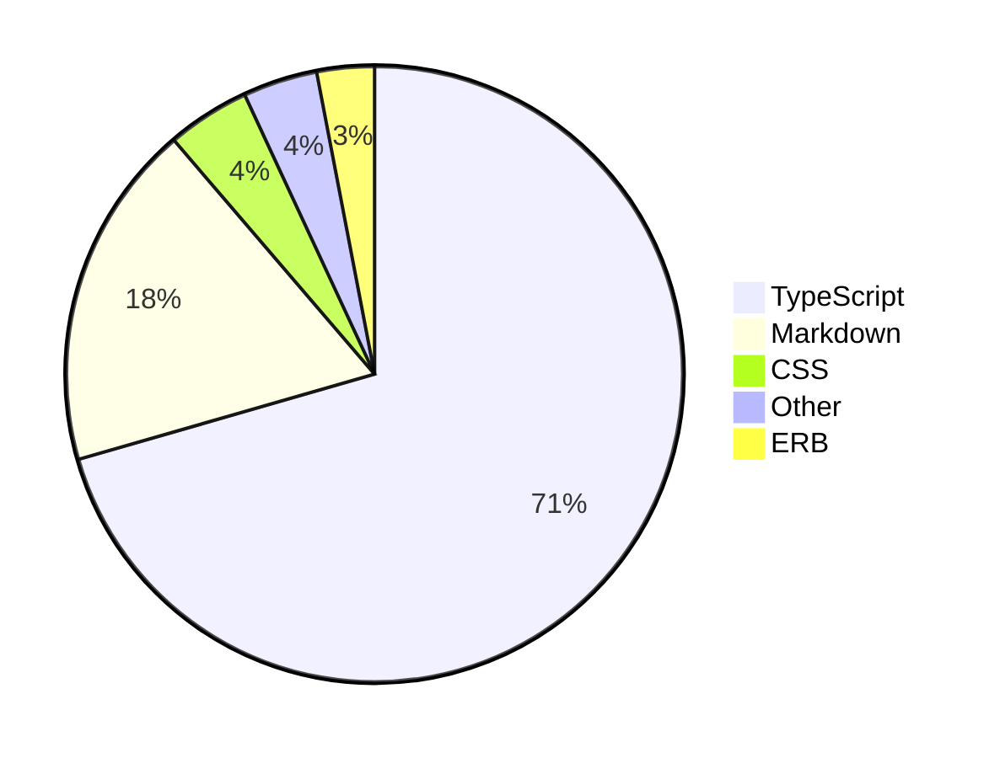
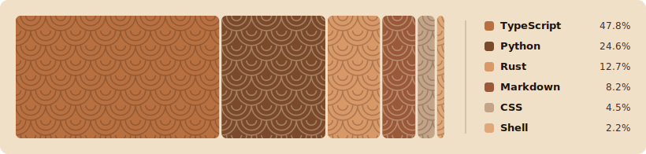

# waka-readme · 青海波

> [WakaTime](https://wakatime.com) coding stats on your profile readme — rendered as a **Mermaid** pie chart or a custom **seigaiha** (青海波) SVG wave band.

[](https://github.com/skvggor/waka-readme/actions/workflows/testing.yml)

This is a fork of [`athul/waka-readme`](https://github.com/athul/waka-readme) that swaps the classic ASCII bar graph for two cleaner renderers:

- **`mermaid`** — a pie chart rendered natively by GitHub Markdown (default).
- **`seigaiha`** — a self-contained SVG committed to your repo, drawing a segmented wave band where each language is a proportional slice in an earthy terracotta palette.

## Graph styles

### Mermaid (default)



### Seigaiha

When `GRAPH_STYLE: seigaiha`, the action generates an SVG, commits it to your repo (default: `assets/waka-readme.svg`) and embeds it in your readme — both in a single commit.

<p align="center">
  
</p>

## Setup

1. Add the placeholder comments where the graph should appear in your `README.md`:

   ```md
   <!--START_SECTION:waka-->
   <!--END_SECTION:waka-->
   ```

   `<!--START_SECTION:waka-->` / `<!--END_SECTION:waka-->` must be kept as is; `waka` can be any alphanumeric string (see `SECTION_NAME`).

2. Add your WakaTime API key (from <https://wakatime.com/api-key/>) as a repository secret named `WAKATIME_API_KEY`.

3. Under `Settings → Actions → Workflow permissions`, enable **Read and write permissions**.

4. Create `.github/workflows/waka-readme.yml`:

   ```yml
   name: waka-readme

   on:
     workflow_dispatch:
     schedule:
       - cron: "0 0 * * *" # daily at 00:00 UTC

   jobs:
     update-readme:
       runs-on: ubuntu-latest
       steps:
         - uses: skvggor/waka-readme@master
           with:
             WAKATIME_API_KEY: ${{ secrets.WAKATIME_API_KEY }}
             GRAPH_STYLE: seigaiha # or "mermaid"
   ```

> If the target repo is **not** your profile readme, also pass `GH_TOKEN` and `REPOSITORY` (see below).

## Inputs

### Required

| Input              | Default              | Description                                                              |
| ------------------ | -------------------- | ------------------------------------------------------------------------ |
| `WAKATIME_API_KEY` | —                    | Your WakaTime / Wakapi / Hakatime API key (store it as a secret).        |
| `GH_TOKEN`         | `${{ github.token }}`| GitHub token with read/write to repo contents. Required only off-profile.|

### Meta

| Input          | Default                     | Description                                                  |
| -------------- | --------------------------- | ------------------------------------------------------------ |
| `API_BASE_URL` | `https://wakatime.com/api`  | Use WakaTime-compatible backends like Wakapi or Hakatime.    |
| `REPOSITORY`   | `${{ github.repository }}`  | Repository where the stats are written.                      |

### Content

| Input          | Default                  | Description                                                                 |
| -------------- | ------------------------ | --------------------------------------------------------------------------- |
| `GRAPH_STYLE`  | `mermaid`                | Renderer: `mermaid` (pie chart) or `seigaiha` (SVG wave band).              |
| `SVG_PATH`     | `assets/waka-readme.svg` | Path of the generated SVG (used only when `GRAPH_STYLE: seigaiha`).         |
| `SECTION_NAME` | `waka`                   | Name used in the `START/END_SECTION` placeholders.                          |
| `TIME_RANGE`   | `last_7_days`            | `last_7_days`, `last_30_days`, `last_6_months`, `last_year` or `all_time`.  |
| `LANG_COUNT`   | `5`                      | Maximum number of languages to display.                                     |
| `SHOW_TITLE`   | `false`                  | Prefix the graph with the queried date range.                               |
| `SHOW_TOTAL`   | `false`                  | Add a total coding time line.                                               |

### Commit

| Input             | Default                                        | Description          |
| ----------------- | ---------------------------------------------- | -------------------- |
| `COMMIT_MESSAGE`  | `Updated waka-readme graph with new metrics`   | Commit message.      |
| `TARGET_BRANCH`   | `NOT_SET`                                       | Target branch.       |
| `TARGET_PATH`     | `NOT_SET`                                       | Target file path.    |
| `COMMITTER_NAME`  | `NOT_SET`                                       | Committer name.      |
| `COMMITTER_EMAIL` | `NOT_SET`                                       | Committer email.     |
| `AUTHOR_NAME`     | `NOT_SET`                                       | Author name.         |
| `AUTHOR_EMAIL`    | `NOT_SET`                                       | Author email.        |

## Example

```yml
name: waka-readme

on:
  workflow_dispatch:
  schedule:
    - cron: "0 0 * * *"

jobs:
  update-readme:
    runs-on: ubuntu-latest
    steps:
      - uses: skvggor/waka-readme@master
        with:
          WAKATIME_API_KEY: ${{ secrets.WAKATIME_API_KEY }} # required
          ### meta
          API_BASE_URL: https://wakatime.com/api # optional
          REPOSITORY: your-username/your-repo # optional
          ### content
          GRAPH_STYLE: seigaiha # optional (mermaid | seigaiha)
          SVG_PATH: assets/waka-readme.svg # optional
          SECTION_NAME: waka # optional
          TIME_RANGE: last_30_days # optional
          LANG_COUNT: 6 # optional
          SHOW_TITLE: true # optional
          SHOW_TOTAL: true # optional
          ### commit
          COMMIT_MESSAGE: Updated waka-readme graph with new metrics # optional
          TARGET_BRANCH: NOT_SET # optional
          TARGET_PATH: NOT_SET # optional
          COMMITTER_NAME: NOT_SET # optional
          COMMITTER_EMAIL: NOT_SET # optional
          AUTHOR_NAME: NOT_SET # optional
          AUTHOR_EMAIL: NOT_SET # optional
```

## Local development

```sh
docker compose -f docker-compose.yml up --build   # run against a .env (see .env.template)
docker compose -f compose.yml up --build           # run the unit tests
```

## Credits

Forked from [`athul/waka-readme`](https://github.com/athul/waka-readme) by Athul Cyriac Ajay. The seigaiha pattern mirrors the one used across [skvggor.dev](https://skvggor.dev). Licensed under [MIT](LICENSE).
